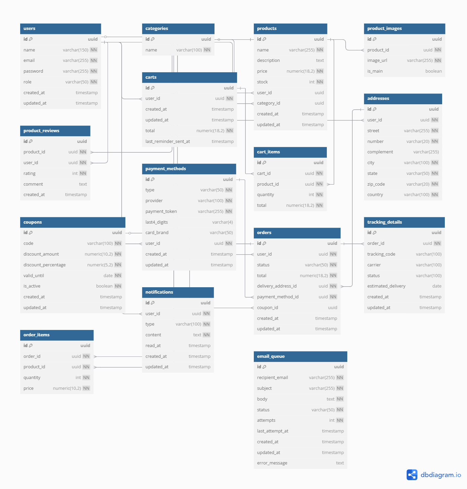

# E-commerce API

RESTful API built with Java 17 and Spring Boot for complete e-commerce platform management. This application includes features such as JWT and OAuth2 authentication, product and order management, coupon handling, shopping cart, admin dashboard, and real-time notifications.

For the original version in [**Português Brasileiro**](README.pt-BR.md)

---

## Table of Contents

- [About the Project](#about-the-project)
- [Entity-Relationship Diagram](#entity-relationship-diagram)
- [Full Documentation](#full-documentation)
- [Main Features](#main-features)
- [Authentication & Security](#authentication--security)
- [Automated Tests](#automated-tests)
- [Technologies Used](#technologies-used)
- [How to Use the API](#how-to-use-the-api)
- [Future Improvements](#future-improvements)
- [Author](#author)

---

## About the Project

The E-commerce API was developed following layered architecture best practices, featuring strong authentication, PostgreSQL persistence, OAuth2 integration, WebSocket real-time notifications, and role-based access control.

---

## Entity-Relationship Diagram

You can view the ER diagram below (or access it in the `/docs` folder):



---

## Full Documentation

The full technical documentation — including endpoints, examples, business rules, workflows, and more — is available at:

📄 [`/docs/Documentacao_Completa.pdf`](./docs/Documentacao_Completa.pdf)

The PDF includes both English and Brazilian Portuguese sections.

---

## Main Features

- User registration and authentication
- Product, category, and coupon management
- Shopping cart with abandonment reminders
- Order processing with simulated tracking
- Real-time notifications via WebSocket
- Admin dashboard with metrics
- Social login via OAuth2

---

## Authentication & Security

- JWT (JSON Web Token) authentication
- OAuth2 social login
- Role-based authorization: `USER`, `MANAGER`, `ADMIN`
- Data validation using Jakarta Bean Validation
- Passwords encrypted with bcrypt
- CSRF protection (optional)
- Access control using `@PreAuthorize` annotations

---

## Automated Tests

The API includes an integration testing suite using:

- Spring Boot Test
- MockMvc
- JUnit 5
- Mockito
- Spring Security Test

---

## Technologies Used

- Java 17+
- Spring Boot, Spring Security, Spring Data JPA, Spring WebSocket
- Hibernate, HikariCP, PostgreSQL
- OAuth2, JWT
- Swagger / OpenAPI
- MapStruct, Lombok
- Maven
- Docker, Docker Compose

---

## How to Use the API

### Prerequisites

- Docker and Docker Compose installed

### Clone the repository

```bash
git clone https://github.com/gabrielpetry23/ecommerce-api.git
cd ecommerce-api
```

### Set up environment variables

In the `docker-compose.yml` file, replace the variable values (`CLIENT_ID`, `EMAIL_USER`, etc.) with your own credentials or test values.

### Start the application

```bash
docker-compose down --volumes
docker-compose up -d --build
```

To monitor logs:

```bash
docker-compose logs -f
```

The app will be available at: `http://localhost:8080`

### Access Swagger UI

Use the following URL to explore the API endpoints:

`http://localhost:8080/swagger-ui/index.html`

### Main Routes

- Authentication: `/users/login`, `/oauth2/login`
- Users: `/users`, `/users/{id}`, `/users/me`
- Products: `/products`, `/products/{id}`, `/products/search`
- Categories: `/categories`, `/categories/{id}`
- Carts: `/carts`, `/carts/{id}/items`, `/users/{userId}/cart`
- Orders: `/orders`, `/orders/{id}`, `/orders/{orderId}/tracking`
- Coupons: `/coupons`
- Notifications: `/users/{userId}/notifications`
- Addresses: `/users/{userId}/addresses`
- Payment Methods: `/users/{userId}/payment-methods`
- Metrics: `/dashboard/metrics`

Test users and full authentication flow are described in the documentation PDF.

---

## Future Improvements

- Addition of unit tests
- Advanced pagination and sorting
- Centralized logging for monitoring
- Integration with real payment gateways
- Email verification with confirmation link
- Caching system for frequently accessed data

---

## Author

Gabriel Petry  
Email: gabriel.petry08@gmail.com  
GitHub: https://github.com/gabrielpetry23